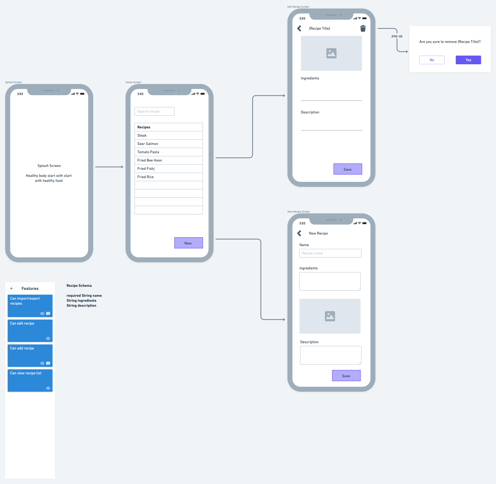

# food_source

---

A Flutter project about storing your favorite food recipes and its source.
This project covers several topics:

1. State management with flutter hook and riverpod.

2. Advance internationalization with code generation.

3. Reusable theme for styles.

4. Widget tests with a combination of high- and low-level concept.

## Getting Started
1. Open an Android emulator or iOS simulator
2. Run `flutter run lib/main.dart`
