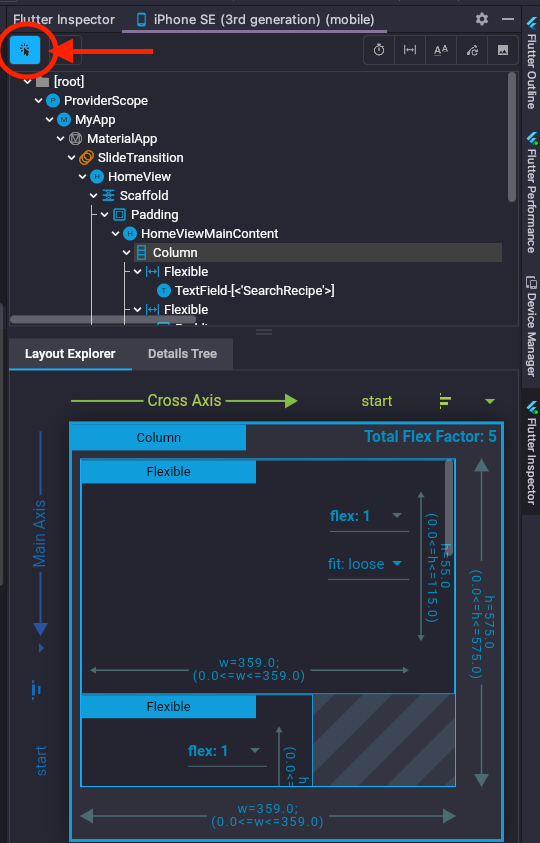
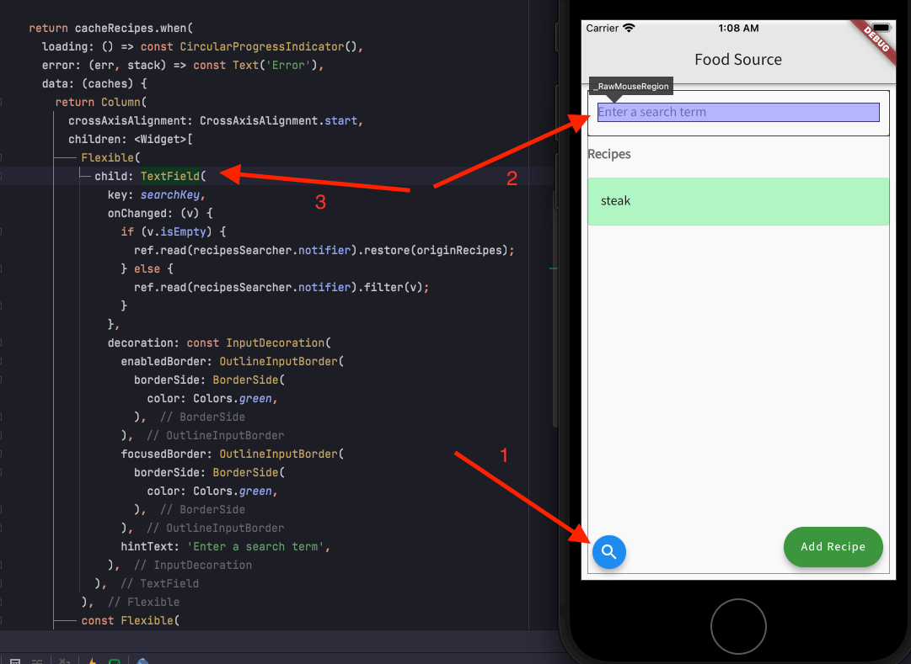

# Testing & Debugging

## Flutter Inspector (Android Studio)
Flutter Inspector offers widget mode allows you to find the location of a widget by tapping into an emulator.

1. Toggle to turn on widget mode

2. Click the search button in the emulator and pick a widget to search for its source code location.

---

For more info, check out Flutter [debugging tools](https://docs.flutter.dev/testing/debugging) on how to run devtool in Android Studio or VS Code